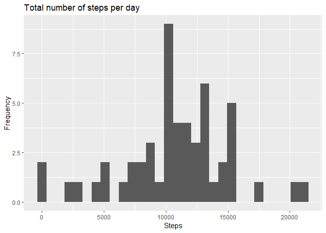
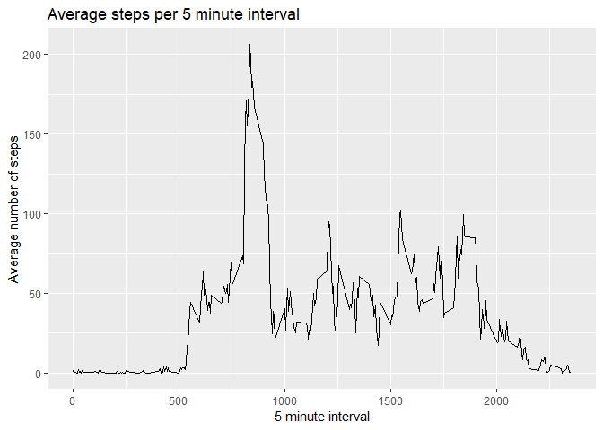
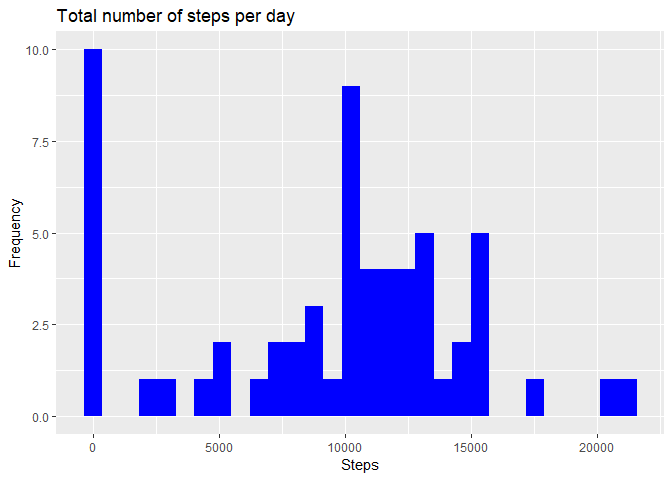
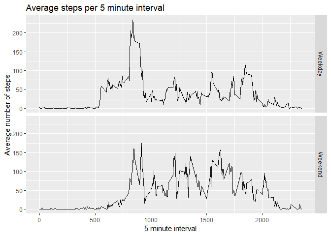

# Reproducible Research: Peer Assessment 1


## Loading and preprocessing the data

Loading the "activity.csv" file. Also changed the date column from a vector to a date type.


```r
library(ggplot2)
library(dplyr)
act<-read.csv("activity.csv")
act$date<- as.Date(act$date)
head(act)
```

```
##   steps       date interval
## 1    NA 2012-10-01        0
## 2    NA 2012-10-01        5
## 3    NA 2012-10-01       10
## 4    NA 2012-10-01       15
## 5    NA 2012-10-01       20
## 6    NA 2012-10-01       25
```


## What is mean total number of steps taken per day?

Calculating the total number of steps per day. Also calculating the mean and median of the total number of steps taken per day


```r
act2<-act %>%
  group_by(date)%>%
  mutate(sum=sum(steps))%>%
  mutate(mean=mean(steps))%>%
  mutate(med=median(steps))%>%
  ungroup()
act3<- act2[c(2,4:6) ]
act3<- act3[!duplicated(act3),]
head(act3)
```

```
## # A tibble: 6 x 4
##   date         sum   mean   med
##   <date>     <int>  <dbl> <dbl>
## 1 2012-10-01    NA NA        NA
## 2 2012-10-02   126  0.438     0
## 3 2012-10-03 11352 39.4       0
## 4 2012-10-04 12116 42.1       0
## 5 2012-10-05 13294 46.2       0
## 6 2012-10-06 15420 53.5       0
```

Plotting a histogram of the total number of steps taken each day


```r
ggplot(data=act3,aes(x=act3$sum))+
  geom_histogram()+
  labs(title="Total number of steps per day",y="Frequency",x="Steps")
```

<!-- -->


## What is the average daily activity pattern?

Time series plot of the 5-minute interval (x-axis) and the average number of steps taken, averaged across all days (y-axis)


```r
int<-aggregate(steps ~ interval,FUN=mean,data=act)

ggplot(int,aes(x=int$interval,y=int$steps))+
  geom_line()+
  labs(title="Average steps per 5 minute interval",x="5 minute interval",y="Average number of steps")
```

<!-- -->

The 5-minute interval, on average across all the days in the dataset, containing the maximum number of steps is:


```r
int$interval[max(int$steps)]
```

```
## [1] 1705
```


## Imputing missing values

The total number of missing values in the dataset:


```r
length(act$steps[is.na(act$steps)])
```

```
## [1] 2304
```

Filling in all of the missing values in the dataset. I have used the median in order to do this. I've created a new dataset with the missing values filled in.


```r
act4<-act

act4$steps[is.na(act4$steps)]<- median(act4$steps,na.rm = T)

act5<- aggregate(steps ~ date,data=act4,FUN = sum,na.rm=T)

head(act5)
```

```
##         date steps
## 1 2012-10-01     0
## 2 2012-10-02   126
## 3 2012-10-03 11352
## 4 2012-10-04 12116
## 5 2012-10-05 13294
## 6 2012-10-06 15420
```

Histogram of the total number of steps taken each day (with NAs filled in)


```r
ggplot(act5,aes(x=act5$steps))+
  geom_histogram(fill="blue")+
  labs(title="Total number of steps per day",y="Frequency",x="Steps")
```

<!-- -->

Calculating the mean and median total of steps taken per day (with NAs filled in):


```r
##Mean without NA
paste("The mean without NA values is equal to", mean(act4$steps, na.rm=T))
```

```
## [1] "The mean without NA values is equal to 32.4799635701275"
```

```r
paste("The median without NA values is equal to", median(act4$steps,na.rm = T))
```

```
## [1] "The median without NA values is equal to 0"
```

```r
##Mean with NA
paste("The mean with NA values is equal to",mean(act$steps,na.rm = T))
```

```
## [1] "The mean with NA values is equal to 37.3825995807128"
```

```r
paste("The median with NA values is equal to",median(act$steps,na.rm=T))
```

```
## [1] "The median with NA values is equal to 0"
```

The mean value differs, the mean value is higher with the NAs. The median value stays the same at 0.

Imputing missing data on the estimates of the total daily number of steps by replacing the NAs with the median values has caused the frequency of 0 steps to increase. This is beacause the NA values have been replaced with 0.

## Are there differences in activity patterns between weekdays and weekends?

Creating a new column which defines each row as weekday/weekend.


```r
act$weekday<-weekdays(act$date)
act$weekday <-ifelse(act$weekday == "Saturday"|act$weekday ==  "Sunday","Weekend","Weekday")
```

Creating a panel plot to compare 5 minute interval results between the weekdays and weekends


```r
int2<-aggregate(steps ~ interval+weekday,FUN=mean,data=act)

ggplot(int2,aes(x=int2$interval,y=int2$steps))+
  geom_line()+
  facet_grid(weekday~.)+
  labs(title="Average steps per 5 minute interval",x="5 minute interval",y="Average number of steps")
```

<!-- -->
